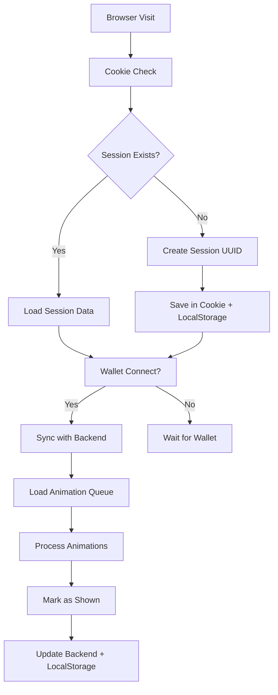

# NFT Animation System - Complete Implementation

## Übersicht

Das vollständige Minting/Burning Animationssystem mit clientseitiger Session-Verwaltung ist jetzt implementiert. Das System arbeitet ohne Login und verwendet Cookies, die nie ablaufen, um den Status pro Benutzermaschine zu verwalten.

## System-Komponenten

### 🍪 Client Session Management
- **Frontend**: `frontend/src/lib/clientSession.ts`
- **Features**:
  - UUID-basierte Session-IDs in persistenten Cookies
  - Keine Ablaufzeit - Session läuft praktisch nie ab
  - LocalStorage für Session-Daten
  - Automatic Browser/Gerät-Erkennung

### 🎬 Animationssystem
- **Mint Animation**: `frontend/src/components/animations/nft-mint-animation.tsx`
- **Burn Animation**: `frontend/src/components/animations/nft-burn-animation.tsx`
- **Queue Manager**: `frontend/src/components/animations/animation-queue-manager.tsx`

### 🔗 Backend Integration

#### Datenbank
- **Client Sessions**: `backend/database/migrations/2025_01_16_000005_create_client_sessions_table.php`
- **Visibility Tracking**: `backend/database/migrations/2025_01_16_000004_create_visibility_tracking_table.php` (bereits vorhanden)

#### Models
- **ClientSession**: `backend/app/Models/ClientSession.php`
- **VisibilityTracking**: `backend/app/Models/VisibilityTracking.php` (bereits vorhanden)

#### API Endpoints
- **Controller**: `backend/app/Http/Controllers/ClientSessionController.php`
- **Routes**: `/api/v1/client-session/*`

## Funktionsweise

### 1. Session-Initialisierung
```typescript
// Automatisch beim ersten Besuch
const session = clientSessionManager.init()
// Session-ID wird in Cookie gespeichert (läuft nie ab)
```

### 2. Wallet-Verbindung
```typescript
// Bei Wallet-Verbindung wird Session synchronisiert
await clientSessionAPI.syncSession(walletAddress)
```

### 3. Animation Queue
```typescript
// Automatisches Laden ausstehender Animationen
const response = await clientSessionAPI.getAnimationStatus()
// Animationen werden in Queue eingereiht und abgespielt
```

### 4. Animation-Statusverfolgung
- **Clientseitig**: LocalStorage für sofortige Verfügbarkeit
- **Serverseitig**: Datenbank für persistent Tracking
- **Synchronisation**: Automatische Sync zwischen Client und Server

## API Endpoints

### Client Session API

| Method | Endpoint | Beschreibung |
|--------|----------|--------------|
| POST | `/api/v1/client-session/init` | Initialisiert Session |
| POST | `/api/v1/client-session/sync` | Synchronisiert mit Wallet |
| GET | `/api/v1/client-session/status` | Holt Animation Status |
| POST | `/api/v1/client-session/animation/mint/shown` | Markiert Mint-Animation als gezeigt |
| POST | `/api/v1/client-session/animation/burn/shown` | Markiert Burn-Animation als gezeigt |
| GET | `/api/v1/client-session/{sessionId}` | Holt Session Details |

## Animations-Features

### ✨ Mint Animation
- **Effekte**: Scale, Rotate, Blur, Glow, Sparkles
- **Dauer**: ~2.5 Sekunden
- **Sounds**: Keine (visuell fokussiert)
- **Interaktion**: Klick zum Überspringen

### 🔥 Burn Animation  
- **Effekte**: Fire, Smoke, Fade, Color-shift
- **Dauer**: ~3 Sekunden
- **Visuell**: Brennende Effekte mit Partikeln
- **Interaktion**: Klick zum Überspringen

### 📋 Queue System
- **Automatisch**: Lädt ausstehende Animationen
- **Sequenziell**: Eine Animation nach der anderen
- **Persistent**: Übersteht Browser-Neustarts
- **Priorität**: Mint vor Burn Animationen

## Datenfluss



## Database Schema

### client_sessions
```sql
CREATE TABLE client_sessions (
    id BIGINT PRIMARY KEY,
    session_id VARCHAR(255) UNIQUE,
    wallet_address VARCHAR(255) NULLABLE,
    first_seen_at TIMESTAMP,
    last_seen_at TIMESTAMP,
    nft_animation_statuses JSON,
    user_agent VARCHAR(255),
    ip_address VARCHAR(255),
    created_at TIMESTAMP,
    updated_at TIMESTAMP
);
```

### visibility_tracking (bereits vorhanden)
```sql
CREATE TABLE visibility_tracking (
    id BIGINT PRIMARY KEY,
    wallet_address VARCHAR(255),
    token_id VARCHAR(255),
    token_type VARCHAR(255),
    has_been_visible BOOLEAN,
    needs_mint_animation BOOLEAN,
    needs_burn_animation BOOLEAN,
    animation_queue JSON,
    -- weitere Felder...
);
```

## Integration in Frontend

### Hauptseite Integration
```typescript
// In page.tsx
import { AnimationQueueManager } from '@/components/animations/animation-queue-manager'
import { clientSessionAPI } from '@/lib/clientSessionAPI'

// Bei Wallet-Verbindung
useEffect(() => {
  if (isConnected && address) {
    fetchBackendData()
    clientSessionAPI.initSession(address)
      .catch(error => console.error('Failed to init client session:', error))
  }
}, [isConnected, address, fetchBackendData])

// Animation Queue Manager Komponente
<AnimationQueueManager
  nfts={transformedNFTs}
  walletAddress={address}
  onAnimationComplete={(animation) => {
    console.log('Animation completed:', animation.type, animation.nft.nftType.name)
  }}
/>
```

## Vorteile des Systems

### 🔒 Datenschutz
- Keine personenbezogenen Daten ohne Wallet-Verbindung
- Session-IDs sind pseudonym
- Lokale Speicherung für schnelle Verfügbarkeit

### ⚡ Performance  
- Clientseitige Caching in LocalStorage
- Asynchrone Backend-Synchronisation
- Lazy Loading von Animationen

### 🔄 Robustheit
- Funktioniert offline (mit cached Daten)
- Automatische Wiederherstellung bei Verbindungsfehlern
- Graceful Fallbacks

### 🎨 User Experience
- Nahtlose Animationen ohne Unterbrechung
- Automatische Queue-Verarbeitung
- Visuelles Feedback bei Aktionen

## Wartung & Monitoring

### Backend Commands
```php
// Bereinigung alter Sessions (> 30 Tage inaktiv)
php artisan tinker
>>> App\Models\ClientSession::cleanupOldSessions();
```

### Debug Tools
- Development Mode zeigt Queue-Status
- Console Logs für API-Aufrufe
- Animation-Debug-Panel (nur Development)

## Status

✅ **Vollständig implementiert**
- ✅ Cookie-basiertes Session System
- ✅ Backend API & Datenbank
- ✅ Mint/Burn Animationen
- ✅ Animation Queue System
- ✅ Frontend Integration
- ✅ Status Synchronisation

## Nächste Schritte

1. **Testing**: Umfassende Tests mit verschiedenen Szenarien
2. **Performance**: Optimierung für große NFT-Collections
3. **Analytics**: Tracking von Animation-Nutzung
4. **Sounds**: Audio-Effekte für Animationen (optional)

